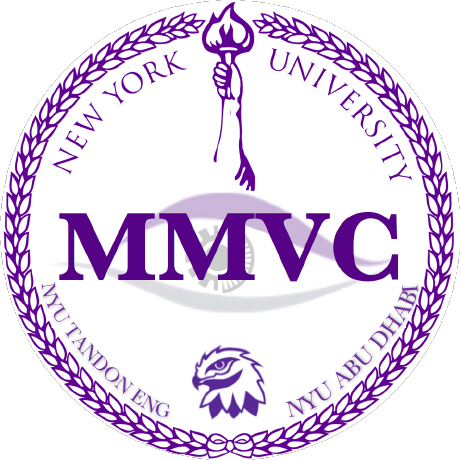

# KUKA_Project
Simulation for the upcoming paper

This ROS Package has been developed by [NYU Multimedia and Visual Computing Lab](https://wp.nyu.edu/mmvc/) at New York University Abu Dhabi, for an upcoming paper.

## Installation

Then clone this repository in Ubuntu Noetic Catkin Workspace Folder.

